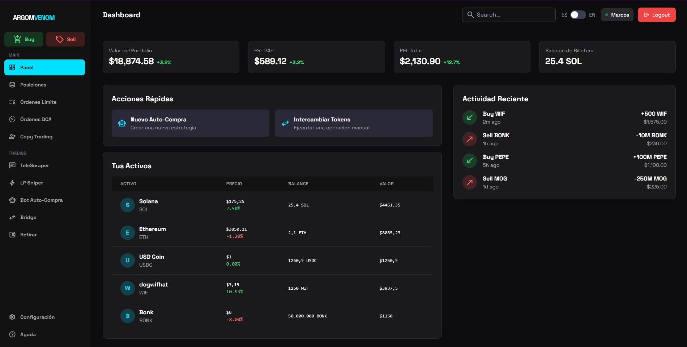

# **ARGOM VENOM - Trading Dashboard Profesional**
_Sistema de trading avanzado con Telegram scraper integrado para análisis de mercado en tiempo real_

## --- Stack Tecnológico ---

**Frontend**

**Backend & Automatización**

**Integraciones**

---

## --- Descripción del Proyecto ---

**ARGOM VENOM** es un sistema de trading profesional diseñado para traders que necesitan una solución completa para monitorear señales de mercado, analizar tendencias de criptomonedas, gestionar operaciones y automatizar el análisis de grupos de Telegram en tiempo real.

## --- **Vista Principal del Sistema** ---

*Haz clic en la imagen para acceder al sistema con usuario demo automático*

---

**Desarrollado por Edwin Estrella**

**Email:** edwinestrella67@gmail.com

---

## Tags
#Trading #Crypto #Dashboard #Telegram #Scraper #React #TypeScript #Electron #Python #Telethon #TelegramAPI #CryptoTrading #MarketAnalysis #RealTime #Authentication #SQLite #Express #NodeJS #ArgomVenom #TradingBot #MarketSignals #TokenAnalysis #DexScreener #PumpFun #Solana #Bitcoin #CryptoSignals #TradingDashboard #ProfessionalTrading

## ---Descripción del Proyecto---

**ARGOM VENOM** es un sistema de trading profesional diseñado para traders que necesitan una solución completa para monitorear señales de mercado, analizar tendencias de criptomonedas, gestionar operaciones y automatizar el análisis de grupos de Telegram en tiempo real.

## ---Características Principales---

### **Dashboard de Trading**
- **Visualización en Tiempo Real:** Gráficos y métricas actualizadas instantáneamente
- **Múltiples Pares:** Soporte para Bitcoin, Ethereum, Solana y más
- **Análisis Técnico:** Indicadores y herramientas de análisis integradas
- **Portafolio Dinámico:** Seguimiento de posiciones y ganancias/pérdidas
- **Alertas Personalizables:** Notificaciones para cambios de precio importantes

### **Telegram Scraper Inteligente**
- **Monitoría 24/7:** Escucha permanente de grupos de trading
- **Filtrado Avanzado:** Detección inteligente de señales relevantes
- **Keywords Configurables:** Busca términos específicos como DexScreener, Pump Fun
- **Grupos Pre-configurados:** Integración con CryptoEnfermosChat y más
- **Formateo Inteligente:** Detección automática de enlaces y patrones

### **Sistema de Autenticación Profesional**
- **Login Seguro:** Autenticación con credenciales encriptadas
- **Sesión Permanente:** Mantén tu sesión activa por 7 días
- **Panel de Control:** Gestión centralizada de usuario
- **Caché Local:** Almacenamiento seguro de sesiones
- **Logout Seguro:** Cierre de sesión con limpieza completa

### **Análisis y Reportes**
- **Métricas en Vivo:** Estadísticas de trading actualizadas
- **Historial Completo:** Registro de todas las operaciones
- **Exportación de Datos:** Compatible con Excel y CSV
- **Dashboard Personalizable:** Adapta la vista a tus necesidades

### **Interfaz Profesional**
- **Design Oscuro:** Optimizado para largas sesiones de trading
- **Responsive:** Compatible con desktop y tablet
- **Intuitivo:** Fácil navegación entre herramientas
- **Modo Fullscreen:** Maximiza tu espacio de análisis

## Stack Tecnológico

### **Frontend**
- **React 19.2** - Biblioteca de interfaz de usuario moderna
- **TypeScript** - Tipado estático y seguridad en el código
- **TailwindCSS** - Framework CSS utility-first
- **Vite** - Build tool ultra-rápido
- **Electron 38.4** - Aplicación desktop multiplataforma

### **Backend & Automatización**
- **Python + Telethon** - Integración con Telegram API
- **Node.js + Express** - Servidor de autenticación
- **SQLite** - Base de datos local para sesiones
- **Socket.IO** - Comunicación en tiempo real

### **Integraciones**
- **Telegram API** - Acceso a grupos y mensajes
- **DexScreener API** - Datos de precios y volumen
- **Pump Fun** - Análisis de tokens emergentes
- **Twitter/X API** - Monitoría de influencers

## Arquitectura del Sistema

### **Módulos Principales**

#### **Módulo de Autenticación**
- Login seguro con credenciales personalizadas
- Gestión de sesiones persistentes
- Panel de control de usuario
- Caché local con encriptación

#### **Módulo Telegram Scraper**
- Conexión con Telegram API usando Telethon
- Monitoría de múltiples grupos simultáneamente
- Filtrado inteligente con keywords
- Detección de patrones y enlaces relevantes

#### **Dashboard Principal**
- Visualización de portafolio
- Gráficos de precios en tiempo real
- Indicadores técnicos personalizados
- Alertas y notificaciones

#### **Gestión de Configuración**
- Panel de configuración de API keys
- Gestión de grupos y keywords
- Personalización del dashboard
- Exportación de datos

## **Características de Interfaz**

### **Desktop Experience**
- **Pantalla Completa:** Aprovecha todo el espacio de tu monitor
- **Múltiples Ventanas:** Organiza tu workspace
- **Atajos de Teclado:** Navegación rápida y eficiente
- **Modo Oscuro:** Protege tu vista durante largas sesiones

### **Interactividad**
- **Arrastrar y Soltar:** Organiza tus widgets
- **Click Derecho:** Menús contextuales rápidos
- **Tooltips:** Ayuda contextual en tiempo real
- **Animaciones Suaves:** Transiciones profesionales

## **Seguridad y Privacidad**

ARGOM VENOM implementa medidas de seguridad enterprise:

- **Encriptación End-to-End:** Protección de datos sensibles
- **Almacenamiento Local:** Tus datos nunca salen de tu dispositivo
- **Autenticación Segura:** Sin almacenamiento de contraseñas en texto plano
- **Session Tokens:** Tokens JWT con expiración automática
- **Sandboxing:** Aislamiento de procesos para seguridad
- **Actualizaciones Automáticas:** Parches de seguridad regularmente
- **Roles y permisos granulares**

## **Análisis y Métricas**

### **Trading Metrics**
- **Profit/Loss:** Ganancias y pérdidas en tiempo real
- **Win Rate:** Porcentaje de operaciones exitosas
- **Risk/Reward:** Relación riesgo-recompensa
- **Drawdown:** Análisis de pérdidas máximas

### **Telegram Analytics**
- **Message Frequency:** Frecuencia de mensajes por grupo
- **Keyword Detection:** Estadísticas de detección de patrones
- **Response Time:** Tiempo de respuesta a señales
- **Success Rate:** Efectividad de las señales detectadas

## **Personalización Avanzada**

### **Temas y Apariencia**
- **Modo Oscuro/Claro:** Cambia según tu preferencia
- **Acentos de Color:** Personaliza la interfaz
- **Tipografía:** Ajusta tamaños y fuentes
- **Layout Flexible:** Organiza los componentes a tu gusto

### **Configuración Trading**
- **Pares Personalizados:** Agrega tus cryptos favoritas
- **Alertas Configurables:** Define tus umbrales
- **Indicadores Técnicos:** Elige tus herramientas preferidas
- **Timeframes:** Múltiples intervalos de tiempo

## **Contacto y Soporte**

### **Desarrollador Principal**
- **Edwin Estrella** - Full Stack Developer & Trading Systems Architect

### **Información de Contacto**
- **Email:** edwinestrella67@gmail.com
- **GitHub:** @EdwinEstrella
- **Telegram:** @EdwinEstrella

### **Soporte Técnico**
- **Bug Reports:** Reporta problemas técnicos
- **Feature Requests:** Sugerencias de mejora
- **Documentación:** Guías y tutoriales
- **Training:** Capacitación personalizada

## **Licencia y Derechos**

Este proyecto es propiedad exclusiva de Edwin Estrella y está protegido por derechos de autor.

**Todos los derechos reservados © 2024 Edwin Estrella**

**Queda estrictamente prohibido:**
- La reventa o distribución comercial sin autorización
- La modificación del código fuente
- El uso para fines comerciales sin licencia
- La reversión de ingeniería

Para más información sobre licenciamiento, contactar directamente.

---

## **Agradecimientos Especiales**

Este proyecto fue desarrollado utilizando tecnologías de vanguardia y herramientas open source:

- **React & Next.js** - Frameworks JavaScript modernos
- **TypeScript** - Superconjunto de JavaScript tipado
- **Electron** - Desarrollo de aplicaciones desktop
- **Python & Telethon** - Integración con Telegram
- **TailwindCSS** - Framework CSS utility-first
- **Vite** - Herramienta de construcción ultra-rápida

---

## **Visión de Futuro**

ARGOM VENOM está en constante evolución con próximas características:

- **AI Trading Bot:** Automatización de estrategias
- **Mobile App:** Versión nativa para iOS/Android
- **Multi-Exchange:** Integración con más exchanges
- **Advanced Analytics:** Machine Learning para predicciones
- **Social Trading:** Copia de estrategias de traders exitosos

---

**Desarrollado con ❤️ y esfuerzo por Edwin Estrella**

*"Simplificando el trading de criptomonedas con tecnología de punta"*

---

**© 2024 - Todos los derechos reservados**
